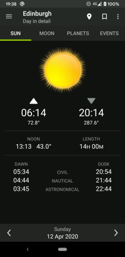
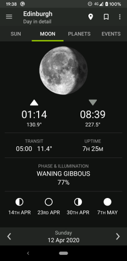
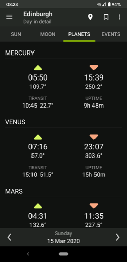

Sundroid
========

Sundroid is an Android app that calculates sunrise, sunset, moonrise and moonset times for any location.

This app was originally published on Google Play in 2010 as a paid app with a free version. It was
necessary to remove it from Google Play in 2015 for a variety of reasons. In 2020 I rebuilt the app
and republished it as a free and open source project.

Some of the features originally included in Sundroid Pro have not been rebuilt yet.

* Sun/moon/planet tracker: Coming soon
* Month calendars: Coming soon
* Year events: Coming soon
* Notifications: Coming soon if supported by modern phones
* Alarms: Not working on modern phones, investigation required
* Widgets: Will not be restored

Screenshots
-----------

Features
--------

* Sunrise and sunset times
* Length of day and solar transit
* Moonrise and moonset times
* Lunar phase and illumination
* Planet rise and set times
* Planet transit and risen time
* View any date and any location
* Locate by GPS, map, and name search
* Save locations

Recent changes
--------------

Sundroid was originally built in 2010 and maintained a number of major compromises until recently,
in order to keep package sizes very small for internal installation as required by alarms and widgets,
and to support the oldest SDK. It has now been almost completely rebuilt but is still being improved.

* Java 8
* Ant scripts replaced with Gradle
* Standardised project structure
* Dropped OpenGL1 and Maps v1 support
* Bumped minimum SDK from 4 to 21
* Migrated to Kotlin
* Migrated to AndroidX
* Marshmallow permissions requests
* Material design including nav drawer
* Dialogs refactored to fragments
* Most deprecated API usage refactored

Future changes
--------------

* Restore landscape support
* Restore tablet support
* Refactor preferences activity
* Extract strings to resources
* Open source translation
* Extract more styles to resources
* Lint

License
-------

Copyright 2010-2020 Dave Morrissey
Licensed under GNU Affero General Public License v3.0. Portions licensed under Apache License 2.0.
